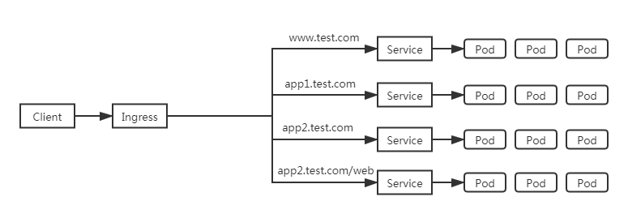
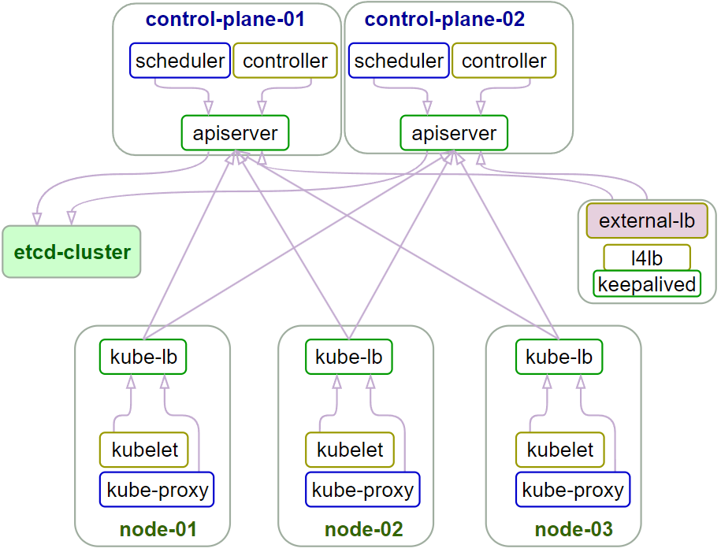
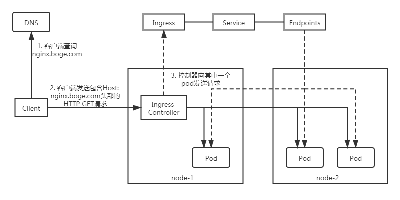

大家好，我是博哥爱运维，这节课带来k8s的流量入口ingress，作为业务对外服务的公网入口，它的重要性不言而喻，大家一定要仔细阅读，跟着博哥的教程一步步实操去理解。

##### Ingress基本概念

在Kubernetes集群中，Ingress作为集群内服务对外暴露的访问接入点，其几乎承载着集群内服务访问的所有流量。Ingress是Kubernetes中的一个资源对象，用来管理集群外部访问集群内部服务的方式。您可以通过Ingress资源来配置不同的转发规则，从而达到根据不同的规则设置访问集群内不同的Service后端Pod。

Ingress资源仅支持配置HTTP流量的规则，无法配置一些高级特性，例如负载均衡的算法、Sessions Affinity等，这些高级特性都需要在Ingress Controller中进行配置。

##### Ingress Controller工作原理

为了使得Ingress资源正常工作，集群中必须要有个Ingress Controller来解析Ingress的转发规则。Ingress Controller收到请求，匹配Ingress转发规则转发到后端Service，而Service转发到Pod，最终由Pod处理请求。Kubernetes中Service、Ingress与Ingress Controller有着以下关系：

- Service是后端真实服务的抽象，一个Service可以代表多个相同的后端服务。
- Ingress是反向代理规则，用来规定HTTP/HTTPS请求应该被转发到哪个Service上。例如根据请求中不同的Host和URL路径，让请求落到不同的 Service上。
- Ingress Controller是一个反向代理程序，负责解析Ingress的反向代理规则。如果Ingress有增删改的变动，Ingress Controller会及时更新自己相应的转发规则，当Ingress Controller收到请求后就会根据这些规则将请求转发到对应的Service。

Ingress Controller通过API Server获取Ingress资源的变化，动态地生成Load Balancer（例如Nginx）所需的配置文件（例如nginx.conf），然后重新加载Load Balancer（例如执行`nginx -s load`重新加载Nginx。）来生成新的路由转发规则。


我们上面学习了通过Service服务来访问pod资源，另外通过修改Service的类型为NodePort，然后通过一些手段作公网IP的端口映射来提供K8s集群外的访问，但这并不是一种很优雅的方式。

```
通常，services和Pod只能通过集群内网络访问。 所有在边界路由器上的流量都被丢弃或转发到别处。 
从概念上讲，这可能看起来像：

    internet
        |
  ------------
  [ Services ]
```


另外可以我们通过LoadBalancer负载均衡来提供外部流量的的访问，但这种模式对于实际生产来说，用起来不是很方便，而且用这种模式就意味着每个服务都需要有自己的的负载均衡器以及独立的公有IP。

我们这是用Ingress，因为Ingress只需要一个公网IP就能为K8s上所有的服务提供访问，Ingress工作在7层（HTTP），Ingress会根据请求的主机名以及路径来决定把请求转发到相应的服务，如下图所示：





```
Ingress是允许入站连接到达集群服务的一组规则。即介于物理网络和群集svc之间的一组转发规则。 
其实就是实现L4 L7的负载均衡:
注意：这里的Ingress并非将外部流量通过Service来转发到服务pod上，而只是通过Service来找到对应的Endpoint来发现pod进行转发

   
    internet
        |
   [ Ingress ]   ---> [ Services ] ---> [ Endpoint ]
   --|-----|--                                 |
   [ Pod,pod,...... ]<-------------------------|
```


要在K8s上面使用Ingress，我们就需要在K8s上部署Ingress-controller控制器，只有它在K8s集群中运行，Ingress依次才能正常工作。Ingress-controller控制器有很多种，比如traefik，但我们这里要用到ingress-nginx这个控制器，它的底层就是用Openresty融合nginx和一些lua规则等实现的。

重点来了，我在讲课中一直强调，本课程带给大家的都是基于生产中实战经验，所以这里我们用的ingress-nginx不是普通的社区版本，而是经过了超大生产流量检验，国内最大的云平台阿里云基于社区版分支出来，进行了魔改而成，更符合生产，基本属于开箱即用，下面是`aliyun-ingress-controller`的介绍：

> 下面介绍只截取了最新的一部分，更多文档资源可以查阅官档：https://help.aliyun.com/zh/ack/product-overview/nginx-ingress-controller#title-ek8-hx4-hlm

```
组件介绍
Ingress基本概念
在Kubernetes集群中，Ingress作为集群内服务对外暴露的访问接入点，其几乎承载着集群内服务访问的所有流量。Ingress是Kubernetes中的一个资源对象，用来管理集群外部访问集群内部服务的方式。您可以通过Ingress资源来配置不同的转发规则，从而达到根据不同的规则设置访问集群内不同的Service所对应的后端Pod。

Nginx Ingress Controller工作原理
为了使得Nginx Ingress资源正常工作，集群中必须要有个Nginx Ingress Controller来解析Nginx Ingress的转发规则。Nginx Ingress Controller收到请求，匹配Nginx Ingress转发规则转发到后端Service所对应的Pod，由Pod处理请求。Kubernetes中Service、Nginx Ingress与Nginx Ingress Controller有着以下关系：

Service是后端真实服务的抽象，一个Service可以代表多个相同的后端服务。

Nginx Ingress是反向代理规则，用来规定HTTP/HTTPS请求应该被转发到哪个Service所对应的Pod上。例如根据请求中不同的Host和URL路径，让请求落到不同Service所对应的Pod上。

Nginx Ingress Controller是Kubernetes集群中的一个组件，负责解析Nginx Ingress的反向代理规则。如果Nginx Ingress有增删改的变动，Nginx Ingress Controller会及时更新自己相应的转发规则，当Nginx Ingress Controller收到请求后就会根据这些规则将请求转发到对应Service的Pod上。


变更记录
2023年10月


版本号  v1.9.3-aliyun.1

镜像地址  registry-cn-hangzhou.ack.aliyuncs.com/acs/aliyun-ingress-controller:v1.9.3-aliyun.1

变更时间  2023年10月24日

变更内容
重要
由于安全原因，自该版本起，组件将会默认禁用所有snippet注解（如nginx.ingress.kubernetes.io/configuration-snippet等）。

出于安全和稳定性风险考量，不建议您开启snippet注解功能。如需使用，请在充分评估风险后，通过在ConfigMapkube-system/nginx-configuration中添加allow-snippet-annotations: "true"手动开启。

默认关闭在注解中添加snippet的功能。

加入--enable-annotation-validation参数，默认开启注解内容校验，缓解CVE-2023-5044。

修复CVE-2023-44487。


变更影响

建议在业务低峰期升级，变更过程中可能会导致已经建立的连接发生瞬断。
```


`aliyun-ingress-controller`有一个很重要的修改，就是它支持路由配置的动态更新，大家用过Nginx的可以知道，在修改完Nginx的配置，我们是需要进行nginx -s reload来重加载配置才能生效的，在K8s上，这个行为也是一样的，但由于K8s运行的服务会非常多，所以它的配置更新是非常频繁的，因此，如果不支持配置动态更新，对于在高频率变化的场景下，Nginx频繁Reload会带来较明显的请求访问问题：

1. 造成一定的QPS抖动和访问失败情况
2. 对于长连接服务会被频繁断掉
3. 造成大量的处于shutting down的Nginx Worker进程，进而引起内存膨胀

详细原理分析见这篇文章： https://developer.aliyun.com/article/692732


我们准备来部署`aliyun-ingress-controller`，下面直接是生产中在用的yaml配置，我们保存了aliyun-ingress-nginx.yaml准备开始部署：

> 详细讲解下面yaml配置的每个部分

```yaml
---
apiVersion: v1
kind: ServiceAccount
metadata:
  name: ingress-nginx
  namespace: kube-system

---
apiVersion: rbac.authorization.k8s.io/v1
kind: Role
metadata:
  labels:
    app.kubernetes.io/component: controller
    app.kubernetes.io/instance: ingress-nginx
    app.kubernetes.io/name: ingress-nginx
    app.kubernetes.io/part-of: ingress-nginx
    app.kubernetes.io/version: 1.9.3
  name: ingress-nginx
  namespace: kube-system
rules:
- apiGroups:
  - ""
  resources:
  - namespaces
  verbs:
  - get
- apiGroups:
  - ""
  resources:
  - configmaps
  - pods
  - secrets
  - endpoints
  verbs:
  - get
  - list
  - watch
- apiGroups:
  - ""
  resources:
  - services
  verbs:
  - get
  - list
  - watch
- apiGroups:
  - networking.k8s.io
  resources:
  - ingresses
  verbs:
  - get
  - list
  - watch
- apiGroups:
  - networking.k8s.io
  resources:
  - ingresses/status
  verbs:
  - update
- apiGroups:
  - networking.k8s.io
  resources:
  - ingressclasses
  verbs:
  - get
  - list
  - watch
- apiGroups:
  - ""
  resourceNames:
  - ingress-controller-leader-nginx
  resources:
  - configmaps
  verbs:
  - get
  - update
- apiGroups:
  - ""
  resources:
  - configmaps
  verbs:
  - create
- apiGroups:
  - coordination.k8s.io
  resourceNames:
  - ingress-controller-leader-nginx
  resources:
  - leases
  verbs:
  - get
  - update
- apiGroups:
  - coordination.k8s.io
  resources:
  - leases
  verbs:
  - create
- apiGroups:
  - ""
  resources:
  - events
  verbs:
  - create
  - patch
- apiGroups:
  - discovery.k8s.io
  resources:
  - endpointslices
  verbs:
  - list
  - watch
  - get
---
apiVersion: rbac.authorization.k8s.io/v1
kind: ClusterRole
metadata:
  labels:
    app.kubernetes.io/instance: ingress-nginx
    app.kubernetes.io/name: ingress-nginx
    app.kubernetes.io/part-of: ingress-nginx
    app.kubernetes.io/version: 1.9.3
  name: ingress-nginx
rules:
- apiGroups:
  - ""
  resources:
  - configmaps
  - endpoints
  - nodes
  - pods
  - secrets
  - namespaces
  verbs:
  - list
  - watch
- apiGroups:
  - coordination.k8s.io
  resources:
  - leases
  verbs:
  - list
  - watch
- apiGroups:
  - ""
  resources:
  - nodes
  verbs:
  - get
- apiGroups:
  - ""
  resources:
  - services
  verbs:
  - get
  - list
  - watch
- apiGroups:
  - networking.k8s.io
  resources:
  - ingresses
  verbs:
  - get
  - list
  - watch
- apiGroups:
  - ""
  resources:
  - events
  verbs:
  - create
  - patch
- apiGroups:
  - networking.k8s.io
  resources:
  - ingresses/status
  verbs:
  - update
- apiGroups:
  - networking.k8s.io
  resources:
  - ingressclasses
  verbs:
  - get
  - list
  - watch
- apiGroups:
  - discovery.k8s.io
  resources:
  - endpointslices
  verbs:
  - list
  - watch
  - get
---
apiVersion: rbac.authorization.k8s.io/v1
kind: RoleBinding
metadata:
  labels:
    app.kubernetes.io/component: controller
    app.kubernetes.io/instance: ingress-nginx
    app.kubernetes.io/name: ingress-nginx
    app.kubernetes.io/part-of: ingress-nginx
    app.kubernetes.io/version: 1.9.3
  name: ingress-nginx
  namespace: kube-system
roleRef:
  apiGroup: rbac.authorization.k8s.io
  kind: Role
  name: ingress-nginx
subjects:
- kind: ServiceAccount
  name: ingress-nginx
  namespace: kube-system
---
apiVersion: rbac.authorization.k8s.io/v1
kind: ClusterRoleBinding
metadata:
  labels:
    app.kubernetes.io/instance: ingress-nginx
    app.kubernetes.io/name: ingress-nginx
    app.kubernetes.io/part-of: ingress-nginx
    app.kubernetes.io/version: 1.9.3
  name: ingress-nginx
roleRef:
  apiGroup: rbac.authorization.k8s.io
  kind: ClusterRole
  name: ingress-nginx
subjects:
- kind: ServiceAccount
  name: ingress-nginx
  namespace: kube-system


# https://www.cnblogs.com/dudu/p/12197646.html
#---
#apiVersion: monitoring.coreos.com/v1
#kind: ServiceMonitor
#metadata:
#  labels:
#    app: ingress-nginx
#  name: nginx-ingress-scraping
#  namespace: kube-system
#spec:
#  endpoints:
#  - interval: 30s
#    path: /metrics
#    port: metrics
#  jobLabel: app
#  namespaceSelector:
#    matchNames:
#    - ingress-nginx
#  selector:
#    matchLabels:
#      app: ingress-nginx

---

apiVersion: v1
kind: Service
metadata:
  labels:
    app: ingress-nginx
  name: nginx-ingress-lb
  namespace: kube-system
spec:
  # DaemonSet need:
  # ----------------
  type: ClusterIP
  # ----------------
  # Deployment need:
  # ----------------
#  type: NodePort
  # ----------------
  ports:
  - name: http
    port: 80
    targetPort: 80
    protocol: TCP
  - name: https
    port: 443
    targetPort: 443
    protocol: TCP
  - name: metrics
    port: 10254
    protocol: TCP
    targetPort: 10254
  selector:
    app: ingress-nginx

---
apiVersion: v1
kind: Service
metadata:
  name: ingress-nginx-controller-admission
  namespace: kube-system
spec:
  type: ClusterIP
  ports:
    - name: https-webhook
      port: 443
      targetPort: 8443
  selector:
    app: ingress-nginx

---
# all configmaps means:
# https://github.com/kubernetes/ingress-nginx/blob/master/docs/user-guide/nginx-configuration/configmap.md

kind: ConfigMap
apiVersion: v1
metadata:
  name: nginx-configuration
  namespace: kube-system
  labels:
    app: ingress-nginx
data:
  allow-snippet-annotations: "true"
  allow-backend-server-header: "true"
  disable-access-log: "false"
  enable-underscores-in-headers: "true"
  generate-request-id: "true"
  ignore-invalid-headers: "true"
  keep-alive: "900"
  keep-alive-requests: "10000"
  large-client-header-buffers: 5 20k
  log-format-upstream: '{"@timestamp": "$time_iso8601","remote_addr": "$remote_addr","x-forward-for": "$proxy_add_x_forwarded_for","request_id": "$req_id","remote_user": "$remote_user","bytes_sent": $bytes_sent,"request_time": $request_time,"status": $status,"vhost": "$host","request_proto": "$server_protocol","path": "$uri","request_query": "$args","request_length": $request_length,"duration": $request_time,"method": "$request_method","http_referrer": "$http_referer","http_user_agent":  "$http_user_agent","upstream-sever":"$proxy_upstream_name","proxy_alternative_upstream_name":"$proxy_alternative_upstream_name","upstream_addr":"$upstream_addr","upstream_response_length":$upstream_response_length,"upstream_response_time":$upstream_response_time,"upstream_status":$upstream_status}'
  max-worker-connections: "65536"
  proxy-body-size: 20m
  proxy-connect-timeout: "10"
  proxy-read-timeout: "60"
  proxy-send-timeout: "60"
  reuse-port: "true"
  server-tokens: "false"
  ssl-redirect: "false"
  upstream-keepalive-connections: "300"
  upstream-keepalive-requests: "1000"
  upstream-keepalive-timeout: "900"
  worker-cpu-affinity: ""
  worker-processes: "1"
  http-redirect-code: "301"
  proxy_next_upstream: error timeout http_502
  ssl-ciphers: ECDHE-RSA-AES128-GCM-SHA256:ECDHE-ECDSA-AES128-GCM-SHA256:ECDHE-RSA-AES256-GCM-SHA384:ECDHE-ECDSA-AES256-GCM-SHA384:DHE-RSA-AES128-GCM-SHA256:DHE-DSS-AES128-GCM-SHA256:kEDH+AESGCM:ECDHE-RSA-AES128-SHA256:ECDHE-ECDSA-AES128-SHA256:ECDHE-RSA-AES128-SHA:ECDHE-ECDSA-AES128-SHA:ECDHE-RSA-AES256-SHA384:ECDHE-ECDSA-AES256-SHA384:ECDHE-RSA-AES256-SHA:ECDHE-ECDSA-AES256-SHA:DHE-RSA-AES128-SHA256:DHE-RSA-AES128-SHA:DHE-DSS-AES128-SHA256:DHE-RSA-AES256-SHA256:DHE-DSS-AES256-SHA:DHE-RSA-AES256-SHA:AES128-GCM-SHA256:AES256-GCM-SHA384:AES128-SHA256:AES256-SHA256:AES128-SHA:AES256-SHA:AES:CAMELLIA:DES-CBC3-SHA:!aNULL:!eNULL:!EXPORT:!DES:!RC4:!MD5:!PSK:!aECDH:!EDH-DSS-DES-CBC3-SHA:!EDH-RSA-DES-CBC3-SHA:!KRB5-DES-CBC3-SHA
  ssl-protocols: TLSv1 TLSv1.1 TLSv1.2


---
kind: ConfigMap
apiVersion: v1
metadata:
  name: tcp-services
  namespace: kube-system
  labels:
    app: ingress-nginx

---
kind: ConfigMap
apiVersion: v1
metadata:
  name: udp-services
  namespace: kube-system
  labels:
    app: ingress-nginx

---
apiVersion: apps/v1
kind: DaemonSet
#kind: Deployment
metadata:
  name: nginx-ingress-controller
  namespace: kube-system
  labels:
    app: ingress-nginx
  annotations:
    component.revision: "2"
    component.version: 1.9.3
spec:
  # Deployment need:
  # ----------------
#  replicas: 1
  # ----------------
  selector:
    matchLabels:
      app: ingress-nginx
  template:
    metadata:
      labels:
        app: ingress-nginx
      annotations:
        prometheus.io/port: "10254"
        prometheus.io/scrape: "true"
    spec:
      # DaemonSet need:
      # ----------------
      hostNetwork: true
      # ----------------
      affinity:
        podAntiAffinity:
          preferredDuringSchedulingIgnoredDuringExecution:
          - podAffinityTerm:
              labelSelector:
                matchExpressions:
                - key: app
                  operator: In
                  values:
                  - ingress-nginx
              topologyKey: kubernetes.io/hostname
            weight: 100
        nodeAffinity:
          requiredDuringSchedulingIgnoredDuringExecution:
            nodeSelectorTerms:
            - matchExpressions:
              - key: type
                operator: NotIn
                values:
                - virtual-kubelet
              - key: k8s.aliyun.com
                operator: NotIn
                values:
                - "true"
      containers:
      - args:
          - /nginx-ingress-controller
          - --election-id=ingress-controller-leader-nginx
          - --ingress-class=nginx
          - --watch-ingress-without-class
          - --controller-class=k8s.io/ingress-nginx
          - --configmap=$(POD_NAMESPACE)/nginx-configuration
          - --tcp-services-configmap=$(POD_NAMESPACE)/tcp-services
          - --udp-services-configmap=$(POD_NAMESPACE)/udp-services
          - --annotations-prefix=nginx.ingress.kubernetes.io
          - --publish-service=$(POD_NAMESPACE)/nginx-ingress-lb
          - --validating-webhook=:8443
          - --validating-webhook-certificate=/usr/local/certificates/cert
          - --validating-webhook-key=/usr/local/certificates/key
          - --enable-metrics=false
          - --v=2
        env:
          - name: POD_NAME
            valueFrom:
              fieldRef:
                fieldPath: metadata.name
          - name: POD_NAMESPACE
            valueFrom:
              fieldRef:
                fieldPath: metadata.namespace
          - name: LD_PRELOAD
            value: /usr/local/lib/libmimalloc.so
        image: registry-cn-hangzhou.ack.aliyuncs.com/acs/aliyun-ingress-controller:v1.9.3-aliyun.1
        imagePullPolicy: IfNotPresent
        lifecycle:
          preStop:
            exec:
              command:
                - /wait-shutdown
        livenessProbe:
          failureThreshold: 5
          httpGet:
            path: /healthz
            port: 10254
            scheme: HTTP
          initialDelaySeconds: 10
          periodSeconds: 10
          timeoutSeconds: 1
          successThreshold: 1
        name: nginx-ingress-controller
        ports:
          - name: http
            containerPort: 80
            protocol: TCP
          - name: https
            containerPort: 443
            protocol: TCP
          - name: webhook
            containerPort: 8443
            protocol: TCP
        readinessProbe:
          failureThreshold: 3
          httpGet:
            path: /healthz
            port: 10254
            scheme: HTTP
          initialDelaySeconds: 10
          periodSeconds: 10
          timeoutSeconds: 1
          successThreshold: 1
#        resources:
#          limits:
#            cpu: 1
#            memory: 2G
#          requests:
#            cpu: 1
#            memory: 2G
        securityContext:
          allowPrivilegeEscalation: true
          capabilities:
            drop:
              - ALL
            add:
              - NET_BIND_SERVICE
          runAsUser: 101
          # if get 'mount: mounting rw on /proc/sys failed: Permission denied', use:
#          privileged: true
#          procMount: Default
#          runAsUser: 0
        volumeMounts:
        - name: webhook-cert
          mountPath: /usr/local/certificates/
          readOnly: true
        - mountPath: /etc/localtime
          name: localtime
          readOnly: true
      dnsPolicy: ClusterFirst
      initContainers:
      - command:
        - /bin/sh
        - -c
        - |
          if [ "$POD_IP" != "$HOST_IP" ]; then
          mount -o remount rw /proc/sys
          sysctl -w net.core.somaxconn=65535
          sysctl -w net.ipv4.ip_local_port_range="1024 65535"
          sysctl -w kernel.core_uses_pid=0
          fi
        env:
        - name: POD_IP
          valueFrom:
            fieldRef:
              apiVersion: v1
              fieldPath: status.podIP
        - name: HOST_IP
          valueFrom:
            fieldRef:
              apiVersion: v1
              fieldPath: status.hostIP
        image: registry.cn-shanghai.aliyuncs.com/acs/busybox:v1.29.2
        imagePullPolicy: IfNotPresent
        name: init-sysctl
        resources:
          limits:
            cpu: 100m
            memory: 70Mi
          requests:
            cpu: 100m
            memory: 70Mi
        securityContext:
          capabilities:
            add:
            - SYS_ADMIN
            drop:
            - ALL
          # if get 'mount: mounting rw on /proc/sys failed: Permission denied', use:
          privileged: true
          procMount: Default
          runAsUser: 0
      # choose node with set this label running
      # kubectl label node xx.xx.xx.xx boge/ingress-controller-ready=true
      # kubectl get node --show-labels
      # kubectl label node xx.xx.xx.xx boge/ingress-controller-ready-
      nodeSelector:
        boge/ingress-controller-ready: "true"
      priorityClassName: system-node-critical
      restartPolicy: Always
      schedulerName: default-scheduler
      securityContext: {}
      serviceAccount: ingress-nginx
      serviceAccountName: ingress-nginx
      terminationGracePeriodSeconds: 300
      # kubectl taint nodes xx.xx.xx.xx boge/ingress-controller-ready="true":NoExecute
      # kubectl taint nodes xx.xx.xx.xx boge/ingress-controller-ready:NoExecute-
      tolerations:
      - operator: Exists
#      tolerations:
#      - effect: NoExecute
#        key: boge/ingress-controller-ready
#        operator: Equal
#        value: "true"
      volumes:
      - name: webhook-cert
        secret:
          defaultMode: 420
          secretName: ingress-nginx-admission
      - hostPath:
          path: /etc/localtime
          type: File
        name: localtime

---
apiVersion: networking.k8s.io/v1
kind: IngressClass
metadata:
  name: nginx-master
  namespace: kube-system
  annotations:
   ingressclass.kubernetes.io/is-default-class: "true"
spec:
  controller: k8s.io/ingress-nginx


---
apiVersion: admissionregistration.k8s.io/v1
kind: ValidatingWebhookConfiguration
metadata:
  labels:
    name: ingress-nginx
  name: ingress-nginx-admission
webhooks:
  - name: validate.nginx.ingress.kubernetes.io
    matchPolicy: Equivalent
    rules:
      - apiGroups:
          - networking.k8s.io
        apiVersions:
          - v1
        operations:
          - CREATE
          - UPDATE
        resources:
          - ingresses
    failurePolicy: Fail
    sideEffects: None
    admissionReviewVersions:
      - v1
    clientConfig:
      service:
        namespace: kube-system
        name: ingress-nginx-controller-admission
        path: /networking/v1/ingresses
---
apiVersion: v1
kind: ServiceAccount
metadata:
  name: ingress-nginx-admission
  namespace: kube-system
---
apiVersion: rbac.authorization.k8s.io/v1
kind: ClusterRole
metadata:
  name: ingress-nginx-admission
rules:
  - apiGroups:
      - admissionregistration.k8s.io
    resources:
      - validatingwebhookconfigurations
    verbs:
      - get
      - update
---
apiVersion: rbac.authorization.k8s.io/v1
kind: ClusterRoleBinding
metadata:
  name: ingress-nginx-admission
roleRef:
  apiGroup: rbac.authorization.k8s.io
  kind: ClusterRole
  name: ingress-nginx-admission
subjects:
  - kind: ServiceAccount
    name: ingress-nginx-admission
    namespace: kube-system
---
apiVersion: rbac.authorization.k8s.io/v1
kind: Role
metadata:
  name: ingress-nginx-admission
  namespace: kube-system
rules:
  - apiGroups:
      - ""
    resources:
      - secrets
    verbs:
      - get
      - create
---
apiVersion: rbac.authorization.k8s.io/v1
kind: RoleBinding
metadata:
  name: ingress-nginx-admission
  namespace: kube-system
roleRef:
  apiGroup: rbac.authorization.k8s.io
  kind: Role
  name: ingress-nginx-admission
subjects:
  - kind: ServiceAccount
    name: ingress-nginx-admission
    namespace: kube-system
---
apiVersion: batch/v1
kind: Job
metadata:
  name: ingress-nginx-admission-create
  labels:
    name: ingress-nginx
  namespace: kube-system
spec:
  template:
    metadata:
      name: ingress-nginx-admission-create
      labels:
        name: ingress-nginx
    spec:
      containers:
        - name: create
#          image: registry-vpc.cn-hangzhou.aliyuncs.com/acs/kube-webhook-certgen:v1.1.1
          image: registry.cn-beijing.aliyuncs.com/acs/kube-webhook-certgen:v1.5.1
          imagePullPolicy: IfNotPresent
          args:
            - create
            - --host=ingress-nginx-controller-admission,ingress-nginx-controller-admission.$(POD_NAMESPACE).svc
            - --namespace=$(POD_NAMESPACE)
            - --secret-name=ingress-nginx-admission
          env:
            - name: POD_NAMESPACE
              valueFrom:
                fieldRef:
                  fieldPath: metadata.namespace
      restartPolicy: OnFailure
      serviceAccountName: ingress-nginx-admission
      securityContext:
        runAsNonRoot: true
        runAsUser: 2000
---
apiVersion: batch/v1
kind: Job
metadata:
  name: ingress-nginx-admission-patch
  labels:
    name: ingress-nginx
  namespace: kube-system
spec:
  template:
    metadata:
      name: ingress-nginx-admission-patch
      labels:
        name: ingress-nginx
    spec:
      containers:
        - name: patch
          image: registry.cn-hangzhou.aliyuncs.com/acs/kube-webhook-certgen:v1.1.1  # if error use this image
          imagePullPolicy: IfNotPresent
          args:
            - patch
            - --webhook-name=ingress-nginx-admission
            - --namespace=$(POD_NAMESPACE)
            - --patch-mutating=false
            - --secret-name=ingress-nginx-admission
            - --patch-failure-policy=Fail
          env:
            - name: POD_NAMESPACE
              valueFrom:
                fieldRef:
                  fieldPath: metadata.namespace
          securityContext:
            allowPrivilegeEscalation: false
      restartPolicy: OnFailure
      serviceAccountName: ingress-nginx-admission
      securityContext:
        runAsNonRoot: true
        runAsUser: 2000

---
## Deployment need for aliyun'k8s:
#apiVersion: v1
#kind: Service
#metadata:
#  annotations:
#    service.beta.kubernetes.io/alibaba-cloud-loadbalancer-id: "lb-xxxxxxxxxxxxxxxxx"
#    service.beta.kubernetes.io/alibaba-cloud-loadbalancer-force-override-listeners: "true"
#  labels:
#    app: nginx-ingress-lb
#  name: nginx-ingress-lb-boge
#  namespace: kube-system
#spec:
#  externalTrafficPolicy: Local
#  ports:
#  - name: http
#    port: 80
#    protocol: TCP
#    targetPort: 80
#  - name: https
#    port: 443
#    protocol: TCP
#    targetPort: 443
#  selector:
#    app: ingress-nginx
#  type: LoadBalancer


```


##### DaemonSet-00:49:30

开始部署：

```shell
# kubectl  apply -f aliyun-ingress-nginx.yaml 
namespace/ingress-nginx created
serviceaccount/nginx-ingress-controller created
clusterrole.rbac.authorization.k8s.io/nginx-ingress-controller created
clusterrolebinding.rbac.authorization.k8s.io/nginx-ingress-controller created
service/nginx-ingress-lb created
configmap/nginx-configuration created
configmap/tcp-services created
configmap/udp-services created
daemonset.apps/nginx-ingress-controller created

# 这里是以daemonset资源的形式进行的安装
# DaemonSet资源和Deployment的yaml配置类似，但不同的是Deployment可以在每个node上运行多个pod副本，但daemonset在每个node上只能运行一个pod副本
# 这里正好就借运行ingress-nginx的情况下，把daemonset这个资源做下讲解

# 我们查看下pod，会发现空空如也，为什么会这样呢？
# kubectl -n kube-system get pod
注意上面的yaml配置里面，我使用了节点选择配置，只有打了我指定lable标签的node节点，也会被允许调度pod上去运行
      nodeSelector:
        boge/ingress-controller-ready: "true"

# 我们现在来打标签
# kubectl label node 10.0.1.201 boge/ingress-controller-ready=true
node/10.0.1.201 labeled
# kubectl label node 10.0.1.202 boge/ingress-controller-ready=true
node/10.0.1.202 labeled

# 接着可以看到pod就被调试到这两台node上启动了
# kubectl -n kube-system get pod -o wide
NAME                             READY   STATUS    RESTARTS   AGE    IP           NODE         NOMINATED NODE   READINESS GATES
nginx-ingress-controller-lchgr   1/1     Running   0          9m1s   10.0.1.202   10.0.1.202   <none>           <none>
nginx-ingress-controller-x87rp   1/1     Running   0          9m6s   10.0.1.201   10.0.1.201   <none>           <none>
```

我们基于前面学到的deployment和service，来创建一个nginx的相应服务资源，保存为nginx.yaml：

> 注意：记得把前面测试的资源删除掉，以防冲突

```yaml
---
kind: Service
apiVersion: v1
metadata:
  name: new-nginx
spec:
  selector:
    app: new-nginx
  ports:
    - name: http-port
      port: 80
      protocol: TCP
      targetPort: 80

---
# 新版本k8s的ingress配置
apiVersion: networking.k8s.io/v1
kind: Ingress
metadata:
  name: new-nginx
  annotations:
    kubernetes.io/ingress.class: "nginx"
    nginx.ingress.kubernetes.io/force-ssl-redirect: "false"
    nginx.ingress.kubernetes.io/whitelist-source-range: 0.0.0.0/0
    nginx.ingress.kubernetes.io/configuration-snippet: |
      if ($host != 'www.boge.com' ) {
        rewrite ^ http://www.boge.com$request_uri permanent;
      }
spec:
  rules:
    - host: boge.com
      http:
        paths:
          - backend:
              service:
                name: new-nginx
                port:
                  number: 80
            path: /
            pathType: Prefix
    - host: m.boge.com
      http:
        paths:
          - backend:
              service:
                name: new-nginx
                port:
                  number: 80
            path: /
            pathType: Prefix
    - host: www.boge.com
      http:
        paths:
          - backend:
              service:
                name: new-nginx
                port:
                  number: 80
            path: /
            pathType: Prefix
#  tls:
#      - hosts:
#          - boge.com
#          - m.boge.com
#          - www.boge.com
#        secretName: boge-com-tls

# tls secret create command:
#   kubectl -n <namespace> create secret tls boge-com-tls --key boge-com.key --cert boge-com.csr

---
apiVersion: apps/v1
kind: Deployment
metadata:
  name: new-nginx
  labels:
    app: new-nginx
spec:
  replicas: 3  # 数量可以根据NODE节点数量来定义
  selector:
    matchLabels:
      app: new-nginx
  template:
    metadata:
      labels:
        app: new-nginx
    spec:
      containers:
#--------------------------------------------------
      - name: new-nginx
        image: nginx:1.21.6
        env:
          - name: TZ
            value: Asia/Shanghai
        ports:
        - containerPort: 80
        volumeMounts:
          - name: html-files
            mountPath: "/usr/share/nginx/html"
#--------------------------------------------------
      - name: busybox
        image: registry.cn-hangzhou.aliyuncs.com/acs/busybox:v1.29.2
        args:
        - /bin/sh
        - -c
        - >
           while :; do
             if [ -f /html/index.html ];then
               echo "[$(date +%F\ %T)] ${MY_POD_NAMESPACE}-${MY_POD_NAME}-${MY_POD_IP}" > /html/index.html
               sleep 1
             else
               touch /html/index.html
             fi
           done
        env:
          - name: TZ
            value: Asia/Shanghai
          - name: MY_POD_NAME
            valueFrom:
              fieldRef:
                apiVersion: v1
                fieldPath: metadata.name
          - name: MY_POD_NAMESPACE
            valueFrom:
              fieldRef:
                apiVersion: v1
                fieldPath: metadata.namespace
          - name: MY_POD_IP
            valueFrom:
              fieldRef:
                apiVersion: v1
                fieldPath: status.podIP
        volumeMounts:
          - name: html-files
            mountPath: "/html"
          - mountPath: /etc/localtime
            name: tz-config

#--------------------------------------------------
      volumes:
        - name: html-files
          emptyDir:
            medium: Memory
            sizeLimit: 10Mi
        - name: tz-config
          hostPath:
            path: /usr/share/zoneinfo/Asia/Shanghai

---


```

运行它：

```shell
# kubectl apply -f nginx.yaml 

#查看创建的ingress资源
# kubectl get ingress
NAME        CLASS          HOSTS                              ADDRESS   PORTS   AGE
new-nginx   nginx-master   boge.com,m.boge.com,www.boge.com             80      8s


# 我们在其它节点上，加下本地hosts，来测试下效果
10.0.1.201 boge.com m.boge.com www.boge.com

# 可以看到请求成功了
[root@node-2 ~]# curl www.boge.com


# 回到201节点上，看下ingress-nginx的日志
# kubectl -n kube-system  logs --tail=1 nginx-ingress-controller-nblb9
Defaulted container "nginx-ingress-controller" out of: nginx-ingress-controller, init-sysctl (init)
{"@timestamp": "2023-11-22T22:13:14+08:00","remote_addr": "10.0.1.1","x-forward-for": "10.0.1.1","request_id": "f21a1e569751fb55299ef5f1b039852d","remote_user": "-","bytes_sent": 250,"request_time": 0.003,"status": 200,"vhost": "www.boge.com","request_proto": "HTTP/2.0","path": "/","request_query": "-","request_length": 439,"duration": 0.003,"method": "GET","http_referrer": "-","http_user_agent":  "Mozilla/5.0 (Windows NT 10.0; Win64; x64) AppleWebKit/537.36 (KHTML, like Gecko) Chrome/119.0.0.0 Safari/537.36","upstream-sever":"default-new-nginx-80","proxy_alternative_upstream_name":"","upstream_addr":"172.20.247.18:80","upstream_response_length":71,"upstream_response_time":0.003,"upstream_status":200}

```


因为http属于是明文传输数据不安全，在生产中我们通常会配置https加密通信，现在实战下Ingress的tls配置

```shell
# 这里我先自签一个https的证书

#1. 先生成私钥key
# openssl genrsa -out boge.key 2048
Generating RSA private key, 2048 bit long modulus
..............................................................................................+++
.....+++
e is 65537 (0x10001)

#2.再基于key生成tls证书(注意：这里我用的*.boge.com，这是生成泛域名的证书，后面所有新增加的三级域名都是可以用这个证书的)
# openssl req -new -x509 -key boge.key -out boge.csr -days 360 -subj /CN=*.boge.com

# 看下创建结果
# ll
total 8
-rw-r--r-- 1 root root 1099 Nov 27 11:44 boge.csr
-rw-r--r-- 1 root root 1679 Nov 27 11:43 boge.key

```


在生产环境中，如果是自建机房，我们通常会在至少2台node节点上运行有ingress-nginx的pod，那么有必要在这两台node上面部署负载均衡软件做调度，来起到高可用的作用，这里我们用haproxy+keepalived，如果你的生产环境是在云上，假设是阿里云，那么你只需要购买一个负载均衡器SLB，将运行有ingress-nginx的pod的节点服务器加到这个SLB的后端来，然后将请求域名和这个SLB的公网IP做好解析即可，目前我们用二进制部署的K8s集群通信架构如下：



注意在每台node节点上有已经部署有了个精简版的nginx软件kube-lb做四层负载均衡，来转发apiserver的请求的，那么，我们只需要选取两台节点，部署keepalived软件并重新配置kube-lb，来生成VIP达到ha的效果，具体参照文档部署：

https://github.com/easzlab/kubeasz/blob/master/docs/setup/ex-lb.md


做到这里，是不是有点成就感了呢，在已经知道了ingress能给我们带来什么后，我们回过头来理解Ingress的工作原理，这样掌握ingress会更加稳固，这也是我平时学习的方法

如下图，Client客户端对`nginx.boge.com`进行DNS查询，DNS服务器（我们这里是配的本地hosts）返回了Ingress控制器的IP（也就是我们的VIP：10.0.1.222）。然后Client客户端向Ingress控制器发送HTTP请求，并在请求Host头中指定`nginx.boge.com`。Ingress控制器从该头部确定Client客户端是想访问哪个服务，通过与该服务并联的Endpoint对象查看具体的Pod IP，并将Client客户端的请求转发给其中一个pod。



生产环境正常情况下大部分是一个Ingress对应一个Service服务，但在一些特殊情况，需要复用一个Ingress来访问多个服务的，下面我们来实践下

再创建一个nginx的deployment和service，注意名称修改下不要冲突了

```yaml
# Finally you need excute this command:
# kubectl create deployment old-nginx --image=nginx:1.21.6 --replicas=1
# kubectl expose deployment old-nginx --port=80 --target-port=80

# if all done,you need test
#  curl -H "Host: www.boge.com" -H "foo: bar" http://10.0.0.201
#  curl -H "Host: www.boge.com"  http://10.0.0.201

# 1 pod  2 containers and  ingress-nginx L7 + 2 service
---
# namespace
apiVersion: v1
kind: Namespace
metadata:
  name: test-nginx

---
# SVC
kind: Service
apiVersion: v1
metadata:
  name: new-nginx
  namespace: test-nginx
spec:
  selector:
    app: new-nginx
  ports:
    - name: http-port
      port: 80
      protocol: TCP
      targetPort: 80
#      nodePort: 30088
#  type: NodePort

---
# ingress-nginx L7
#  https://yq.aliyun.com/articles/594019
#  https://help.aliyun.com/document_detail/200941.html?spm=a2c4g.11186623.6.787.254168fapBIi0A
#  KAE多个请求参数配置： query("boge_id", /^aaa$|^bbb$/)
apiVersion: networking.k8s.io/v1
kind: Ingress
metadata:
  name: test-nginx
  namespace: test-nginx
  annotations:
    nginx.ingress.kubernetes.io/ssl-redirect: "false"
    # 请求参数匹配  curl www.boge.com?boge_id=ID1
    nginx.ingress.kubernetes.io/service-match: | 
      new-nginx: query("boge_id", /^aaa$|^bbb$/)
    # 请求头中满足正则匹配foo=bar的请求才会被路由到新版本服务new-nginx中
    #nginx.ingress.kubernetes.io/service-match: | 
    #  new-nginx: header("foo", /^bar$/)
    # 在满足上述匹配规则的基础上仅允许50%的流量会被路由到新版本服务new-nginx中
    #nginx.ingress.kubernetes.io/service-weight: |
    #    new-nginx: 50, old-nginx: 50
spec:
  rules:
    - host: www.boge.com
      http:
        paths:
          - backend:
              service:
                name: new-nginx  # 新版本服务
                port:
                  number: 80
            path: /
            pathType: Prefix
          - backend:
              service:
                name: old-nginx  # 老版本服务
                port:
                  number: 80
            path: /
            pathType: Prefix

---
# deployment
apiVersion: apps/v1
kind: Deployment
metadata:
  name: new-nginx
  namespace: test-nginx
  labels:
    app: new-nginx
spec:
  replicas: 1
  selector:
    matchLabels:
      app: new-nginx
  template:
    metadata:
      labels:
        app: new-nginx
    spec:
      containers:
#--------------------------------------------------
      - name: new-nginx
        image: nginx::1.21.6
        ports:
        - containerPort: 80
        volumeMounts:
          - name: html-files
            mountPath: "/usr/share/nginx/html"
#--------------------------------------------------
      - name: busybox
        image: registry.cn-hangzhou.aliyuncs.com/acs/busybox:v1.29.2
        args:
        - /bin/sh
        - -c
        - >
           while :; do
             if [ -f /html/index.html ];then
               echo "[$(date +%F\ %T)] hello" > /html/index.html
               sleep 1
             else
               touch /html/index.html
             fi
           done
        volumeMounts:
          - name: html-files
            mountPath: "/html"

#--------------------------------------------------
      volumes:
        - name: html-files
           # Disk of the working node running pod
          #emptyDir: {}
           # Memory of the working node running pod
          emptyDir:
            medium: Memory
            # use temp disk space
            #medium: ""
              # if emptyDir file size more than 1Gi ,then this pod will be Evicted, just like restert pod
            sizeLimit: 1Gi


```


