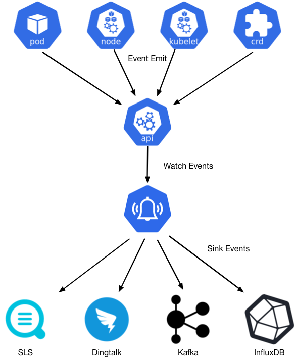

## **Kube-Eventer**： Kubernetes 集群的“事件直播员”，实时传递集群内部的每一个动态。

https://github.com/AliyunContainerService/kube-eventer



### 开始部署
```yaml
---
apiVersion: v1
data:
  content: >-
    {"EventType": "{{ .Type }}","EventNamespace": "{{
    .InvolvedObject.Namespace }}","EventKind": "{{ .InvolvedObject.Kind }}","EventObject": "{{
    .InvolvedObject.Name }}","EventReason": "{{
    .Reason }}","EventTime": "{{ .LastTimestamp }}","EventMessage": "{{ .Message
    }}"}
kind: ConfigMap
metadata:
  name: kubeeventer-webhook
  namespace: kube-system


---
apiVersion: apps/v1
kind: Deployment
metadata:
  labels:
    name: kube-eventer
  name: kube-eventer-webhook
  namespace: kube-system
spec:
  replicas: 1
  selector:
    matchLabels:
      app: kube-eventer
  template:
    metadata:
      labels:
        app: kube-eventer
      annotations:
        scheduler.alpha.kubernetes.io/critical-pod: ''
    spec:
      dnsPolicy: ClusterFirstWithHostNet
      serviceAccount: kube-eventer
      containers:
        - image: registry.aliyuncs.com/acs/kube-eventer:v1.2.7-ca03be0-aliyun
#        - image: registry.us-west-1.aliyuncs.com/acs/kube-eventer:v1.2.7-ca03be0-aliyun
          name: kube-eventer
          command:
            - "/kube-eventer"
            - "--source=kubernetes:https://10.0.1.201:6443"
            ## .e.g,dingtalk sink demo
            #- --sink=dingtalk:[your_webhook_url]&label=[your_cluster_id]&level=[Normal or Warning(default)]&namespaces=[kube-system,kae-app(all)]
            - --sink=webhook:http://10.0.1.202:7777?level=Warning&kinds=Pod&method=POST&header=Content-Type=application/json&custom_body_configmap=kubeeventer-webhook&custom_body_configmap_namespace=kube-system

          env:
          # If TZ is assigned, set the TZ value as the time zone
          - name: TZ
            value: "Asia/Shanghai"
          volumeMounts:
            - name: localtime
              mountPath: /etc/localtime
              readOnly: true
            - name: zoneinfo
              mountPath: /usr/share/zoneinfo
              readOnly: true
          resources:
            requests:
              cpu: 100m
              memory: 100Mi
            limits:
              cpu: 500m
              memory: 250Mi
      hostAliases:
      - hostnames:
        - alarm.boge.com
        ip: 1.6.8.8
      volumes:
        - name: localtime
          hostPath:
            path: /etc/localtime
        - name: zoneinfo
          hostPath:
            path: /usr/share/zoneinfo
---
apiVersion: rbac.authorization.k8s.io/v1
kind: ClusterRole
metadata:
  name: kube-eventer
rules:
  - apiGroups:
      - ""
    resources:
      - configmaps
      - events
    verbs:
      - get
      - list
      - watch
---
apiVersion: rbac.authorization.k8s.io/v1
kind: ClusterRoleBinding
metadata:
  name: kube-eventer
roleRef:
  apiGroup: rbac.authorization.k8s.io
  kind: ClusterRole
  name: kube-eventer
subjects:
  - kind: ServiceAccount
    name: kube-eventer
    namespace: kube-system
---
apiVersion: v1
kind: ServiceAccount
metadata:
  name: kube-eventer
  namespace: kube-system

```
