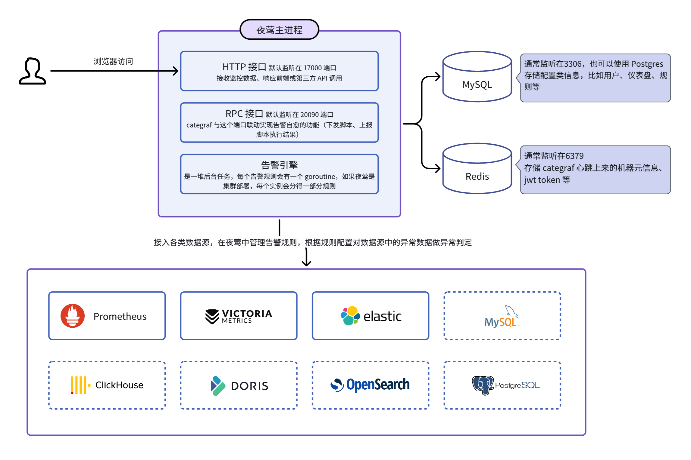
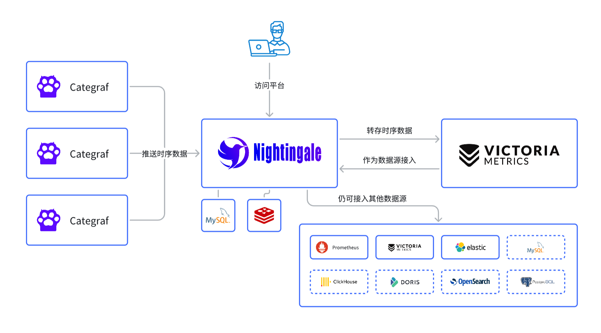

### 夜莺(以下简称N9E)介绍PPT

https://c9xudyniiq.feishu.cn/slides/O6xJsUzZclzeUrdMb9DcynVtnSf

#### 文档

https://flashcat.cloud/docs/content/flashcat-monitor/nightingale-v8/prologue/introduction/

#### 下载中心

https://flashcat.cloud/download/

#### GITHUB

https://github.com/ccfos/nightingale

#### N9E常用的两类生产场景

公司生产已经有了Prometheus监控系统，可使用N9E来作为报警规则处理及发送使用

完全使用N9E来部署监控系统，同时也可接入像Prometheus这样的数据源使用

