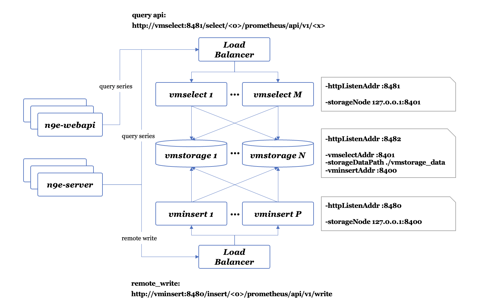

### 夜莺(以下简称N9E)介绍PPT

https://c9xudyniiq.feishu.cn/slides/O6xJsUzZclzeUrdMb9DcynVtnSf

#### 文档

https://flashcat.cloud/docs/content/flashcat-monitor/nightingale-v8/prologue/introduction/


#### 下载中心

https://flashcat.cloud/download/

#### GITHUB

https://github.com/ccfos/nightingale


#### N9E常用的两类生产场景

公司生产已经有了Prometheus监控系统，可使用N9E来作为报警规则处理及发送使用


完全使用N9E来部署监控系统，同时也可接入像Prometheus这样的数据源使用


### 全量部署夜莺N9E监控系统

#### docker部署mysql和redis
大家提前安装好docker环境，这个大家可以自行问AI解决安装问题，确保能正常使用命令docker version

```shell
docker run -d --name mysql-test \
           -p3306:3306 \
           -e MYSQL_ROOT_PASSWORD=bogeit \
           -v /mnt/mysql-data:/var/lib/mysql \
           registry.cn-beijing.aliyuncs.com/bogeit/mysql:5.7.44-oraclelinux7 \
           --character-set-server=utf8mb4 \
           --collation-server=utf8mb4_unicode_ci \
           --max_allowed_packet=20M \
           --lower_case_table_names=1 \
           --max_connections=5000 \
           --sql_mode=STRICT_TRANS_TABLES,ERROR_FOR_DIVISION_BY_ZERO,NO_AUTO_CREATE_USER,NO_ENGINE_SUBSTITUTION


docker run --name myredis \
           --net host --privileged \
           -d registry.cn-beijing.aliyuncs.com/bogeit/redis:6.2.16-alpine3.20 \
           /bin/sh -c "echo 2000 > /proc/sys/net/core/somaxconn && \
           echo 1 > /proc/sys/vm/overcommit_memory && \
           mount -o remount rw /sys && \
           echo never > /sys/kernel/mm/transparent_hugepage/enabled && \
           redis-server --requirepass bogeit"
```


#### 分布式集群时序库 VictoriaMetrics

VictoriaMetrics 是一个可水平扩容的本地化时序数据库存储方案，它的优势有：

* 兼容 Prometheus的API，可以直接使用其配置，通常用于Prometheus的数据存储使用
* 指标数据查询性能很好，比InfluxDB高出20倍左右
* 在处理大量时间序列的数据时，它的内存方便也做了很大优化，比Prometheus少约7倍
* 数据压缩方式非常高效，与Prometheus相比，所需存储空间减少了7倍左右
* 完善的架构设计，可完全代替Prometheus


##### 部署集群数据源存储




```shell
# 角色节点规划
vmstorage  # 10.0.1.202  10.0.1.203  #相关端口 8482 8401 8400 
vmselect  # 10.0.1.202  #相关端口 8481 
vminsert  # 10.0.1.203  #相关端口 8480 

#下载地址 https://github.com/VictoriaMetrics/VictoriaMetrics/releases/latest

# 把vm二进制文件按每台节点的角色规则准备好
cd /mnt
wget https://github.com/VictoriaMetrics/VictoriaMetrics/releases/download/v1.126.0/victoria-metrics-linux-amd64-v1.126.0-cluster.tar.gz

tar xf victoria-metrics-linux-amd64-v1.126.0-cluster.tar.gz && rm victoria-metrics-linux-amd64-v1.126.0-cluster.tar.gz

#nohup ./vm*-prod &>vm.log &
scp vmstorage-prod 10.0.1.202:/usr/bin/
scp vmstorage-prod 10.0.1.203:/usr/bin/

scp vmselect-prod 10.0.1.202:/usr/bin/
scp vminsert-prod 10.0.1.203:/usr/bin/


# vim /usr/lib/systemd/system/vmstorage.service

[Unit]
Description=High-performance, cost-effective and scalable time series database, long-term remote storage for Prometheus
After=network.target

[Service]
Type=simple
StartLimitBurst=5
StartLimitInterval=0
Restart=on-failure
RestartSec=1
ExecStart=/usr/bin/vmstorage-prod -storageDataPath=/var/lib/victoria-metrics-data -loggerTimezone Asia/Shanghai -httpListenAddr :8482 -vminsertAddr :8400 -vmselectAddr :8401
ExecStop=/bin/kill -s SIGTERM $MAINPID
LimitNOFILE=65536
LimitNPROC=32000

[Install]
WantedBy=multi-user.target

# systemctl start vmstorage.service
# systemctl status vmstorage.service
# systemctl enable vmstorage.service
# systemctl is-enabled vmstorage.service


# vim /usr/lib/systemd/system/vmselect.service

[Unit]
Description=High-performance, cost-effective and scalable time series database, long-term remote storage for Prometheus
After=network.target

[Service]
Type=simple
StartLimitBurst=5
StartLimitInterval=0
Restart=on-failure
RestartSec=1
ExecStart=/usr/bin/vmselect-prod -httpListenAddr :8481 -storageNode=10.0.1.202:8401,10.0.1.203:8401
ExecStop=/bin/kill -s SIGTERM $MAINPID
LimitNOFILE=65536
LimitNPROC=32000

[Install]
WantedBy=multi-user.target

# systemctl start vmselect.service
# systemctl status vmselect.service
# systemctl enable vmselect.service
# systemctl is-enabled vmselect.service


# vim /usr/lib/systemd/system/vminsert.service

[Unit]
Description=High-performance, cost-effective and scalable time series database, long-term remote storage for Prometheus
After=network.target

[Service]
Type=simple
StartLimitBurst=5
StartLimitInterval=0
Restart=on-failure
RestartSec=1
ExecStart=/usr/bin/vminsert-prod -httpListenAddr :8480 -storageNode=10.0.1.202:8400,10.0.1.203:8400
ExecStop=/bin/kill -s SIGTERM $MAINPID
LimitNOFILE=65536
LimitNPROC=32000

[Install]
WantedBy=multi-user.target

# systemctl start vminsert.service
# systemctl status vminsert.service
# systemctl enable vminsert.service
# systemctl is-enabled vminsert.service


curl http://10.0.1.202:8482/metrics  # vmstorage
curl http://10.0.1.203:8482/metrics  # vmstorage
curl http://10.0.1.202:8481/metrics  # vmselect
curl http://10.0.1.203:8480/metrics  # vminsert


iptables -I INPUT -p tcp --dport 8482 -j ACCEPT
iptables -I INPUT -p tcp --dport 8481 -j ACCEPT
iptables -I INPUT -p tcp --dport 8480 -j ACCEPT
```


