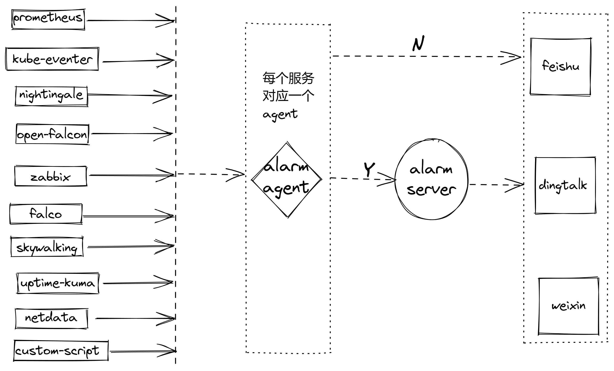

# 博哥的运维监控私房菜

大家好，我是博哥爱运维。欢迎来到我的频道学习运维监控相关的知识。

在这里你能收获：

1、掌握在企业部署设计完整的监控体系架构

2、掌握市面上绝大部分主流的运维监控软件使用

3、获得并熟悉开发一套运维报警中心系统的完整思路

* 在运维行业，有一句话广为流传：“无监控，不运维。” 这句话一点也不夸张，监控被称为运维的“第三只眼”。没有监控的支持，无论是基础运维还是业务运维，都像在黑暗中摸索。因此，监控是运维工作的基石。

* 运维工程师需要依靠监控数据来做决策，这一点至关重要。有人戏称运维人员为“背锅侠”，但有了监控和充足的数据支持，运维人员可以做到有理有据，从而摆脱无端指责。所以，作为一名运维工程师，构建一个有效的监控系统是首要任务。

* 监控是运维工作的第一道防线。业务系统可能暂时不进行运维自动化，甚至不实施 `DevOps`，但绝不能没有监控。监控是业务的“眼睛”，能够在第一时间发现异常问题，从而迅速采取措施解决问题。运维工作的优劣，往往取决于监控系统的完善程度。

* 监控是运维系统的基础。要评估一个公司或部门的运维水平，只需看看他们的监控系统是否完善。这是衡量运维能力的重要指标。

* 纵观市面上已有的监控类课程，要么就是太单一，要么就是偏理论，看的过程是都觉得讲得很好很专业，但看完回头在工作生产环境中实施不是这里报错就是那里有问题，仔细分析了下，可能和讲课的人并非纯运维出身，一开始就灌输太多枯燥的理论知识，只会让人在潜意识里面产生反感，导致看完过后没多久就忘了。

* 博哥的课程，从实战出发，先让你知道这个东西怎么用，用了有什么效果，能在工作中马上实践出来，对于一些枯燥的内容，在需要用到时再翻资料也不迟，何况现在有了各类AI工具的加持，或者等监控架构稳定了再回头啃原理，加深理解，就像学开车一样，都是在实战中磨练技术，没听说只靠科目1的理论就能学会开车的。

## 运维报警中心

为什么会想到开发这么一套运维监控中心

* 简化多样化工具的报警配置复杂性
* 多维度监控报警模板的统一性输出
* 告警消息静默、抑制降噪、排班认领
* 报警AI分析

## 监控系统基本架构

